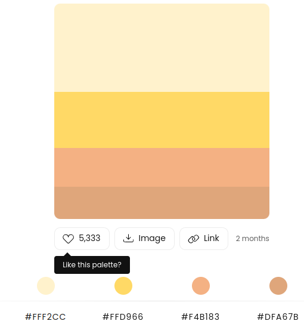
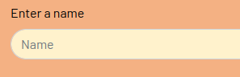
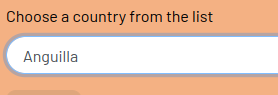
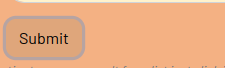
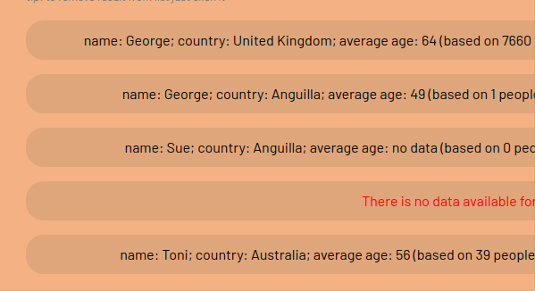

# Agify and Genderize a Name!

[Live site here](https://doctorandrewbrown.github.io/ageify/)
* This app is called "Agify and Genderize a Name!". The app allows people to enter a name and country and have the average age and the gender for that name in that country to be displayed in an attractive user-interface. 
* The app allows users to interact with two free api services, [Ageify](https://agify.io/) and [Genderize](https://genderize.io/).
* The app provides an HTML/CSS interface and the javascript logic needed for users to consume data provided by the two above api services. The user enters a name and country and the app sends the user input to the two apis, processes the data returned and presents the results in an attractive interface.
* Additional data obtained from the apis and available through the app, is the probability of the gender given and the population sizes from which the age and gender statistics are calculated.
    
* The site is intended for fun, for people curious about the age group into which a name falls and also the proportion of males and females having certain names. An example use might involve questions like "how many people named Ashley in the UK are male?", for instance.
  
* The app allows easy comparison of multiple results presented in a list form in an attractive interface. 

## UX
* Design was kept simple including only the features required to get user input, submit a query, display a results list, and remove unwanted results from the display.
* The only user controls needed were an input field for users to input any name, an input select list to choose from a hard-coded list of country options, and a submit button. This approach allows flexibility and ease of use while keeping errors to a minimum. 
* Simple clear user instructions are provided in label elements attached to the input elements.
*  The interface also has the feature that unwanted results can be removed from the display list by clicking. This functionality is indicated to the user via a simple  message in the interface. 
* Ease of use is also supported by using placeholder text in input fields and use of the onfocus attribute in the "name" input element.
* The required "country" input is facilitated with a hard-coded select option dropdown menu with the default value set to "United Kingdom".
* The submit button is clearly indicated and placed in a conventional position.
* Visual design of the input form uses the convention of "pill" styling to provide an attractive interface.
* Coherent styling is used to present the results list where the same "pill" styling is used.
* As well as in the styling and the design of user controls, UX is also considered in the design of the logic of the app. Javascript is used to ensure that results are presented in the most meaningful way. Cases of missing data and no data returned by the apis are handled by the logic to give the most value to users, with for example, informative messages rather than "null" values returned by the apis (for more details see [TESTING.md](TESTING.md)).  
  

### Colour Scheme
The app colour scheme was based on a palette by [Colorhunt](https://colorhunt.co/palette/fff2ccffd966f4b183dfa67b) shown below,

- `#000000` used for text colour.
- `##F4B183` used for site background colour.
- `#FFF2CC` used for input background colour.
- `#DFA67B` used for results list and button background colour.

### Typography

- [Barlow](https://fonts.google.com/specimen/Barlow?query=barlow) font was used for all site text.

## User Stories

|User action |
|--------|
| As a new site user, I would like to enter a name and country, so that I can find the average age and probable gender for the name for that country.
| As a new site user, I would like to have results for multiple requests shown as a list, so that I can make comparisons e.g. same name in different countries.
| As a new site user, I would like to have the ability to remove unwanted results from display, so that I can keep results uncluttered for recording in a screen shot for example.
| As a new user I would like to be able to find what proportion of people in the UK who are named Ashley are males?
| As a new user I would like to find the average age of people in USA who are named George?||

## Wireframes

To follow best practice, wireframes were developed for mobile, tablet, and desktop sizes.
### Wireframes
- [mobile](documentation/wireframes/mobile-wireframe.jpg) 
- [tablet/desktop](documentation/wireframes/laptop-wireframe.jpg) 

## Features

### Existing Features

- **Name input field**
 
    - This feature allows a user to input any name they wish to check. Explanatory placeholder text is provided, the field is required and the onfocus attribute ensures one-click only is needed to clear the field for subsequent queries.
    - 

- **Country input select option field**

  -  This feature allows the user to select a country option from the ISO-3166-1: Alpha-2 Codes list of countries in dropdown form. This implementation removes chance of error when the user inputs a country. This field is also required.
    - 

- **Submit button**

    - The submit button is conventionally positioned and styled and submits a query once the required fields are selected.
    - 

- **Results record**

    - The individual results records show combined data returned from the two apis in a user-friendly format.
    - 

- **Results list**
    - Users can make multiple requests and the results are shown as a list. 
    - 
- **"Warning" message**

    - Where neither api returns any data for a request, a user friendly warning is given.
    - 
- **User "tip"**

    - Once a user has a list of records from their search they can remove any records they do not want by clicking on the record. Users are informed of this functionality via an unobtrusive message in the user interface.  
    - 

## Tools & Technologies Used

- [HTML](https://en.wikipedia.org/wiki/HTML) used for the main site content.
- [CSS](https://en.wikipedia.org/wiki/CSS) used for the main site design and layout.

- [CSS Flexbox](https://www.w3schools.com/css/css3_flexbox.asp) used for an enhanced responsive layout.

- [JavaScript](https://www.javascript.com) used for user interaction on the site.

- [Git](https://git-scm.com) used for version control. (`git add`, `git commit`, `git push`)
- [GitHub](https://github.com) used for secure online code storage.
- [GitHub Pages](https://pages.github.com) used for hosting the deployed front-end site.
- [Bootstrap](https://getbootstrap.com) used as the front-end CSS framework for modern responsiveness and pre-built components.
- [VSCode](https://code.visualstudio.com/) IDE for development work.

## Testing

For all testing, please refer to the [TESTING.md](TESTING.md) file.

## Deployment

The site was deployed to GitHub Pages. The steps to deploy are as follows:
- In the [GitHub repository](https://github.com/doctorandrewbrown/agify), navigate to the Settings tab 
- From the source section drop-down menu, select the **Main** Branch, then click "Save".
- The page will be automatically refreshed with a detailed ribbon display to indicate the successful deployment.

The live link can be found [here](https://doctorandrewbrown.github.io/ageify)

### Local Deployment

This project can be cloned or forked in order to make a local copy on your own system.

#### Cloning

You can clone the repository by following these steps:

1. Go to the [GitHub repository](https://github.com/doctorandrewbrown/agify) 
2. Locate the Code button above the list of files and click it 
3. Select if you prefer to clone using HTTPS, SSH, or GitHub CLI and click the copy button to copy the URL to your clipboard
4. Open Git Bash or Terminal
5. Change the current working directory to the one where you want the cloned directory
6. In your IDE Terminal, type the following command to clone my repository:
	- `git clone https://github.com/doctorandrewbrown/agify.git`
7. Press Enter to create your local clone.

Alternatively, if using Gitpod, you can click below to create your own workspace using this repository.

Please note that in order to directly open the project in Gitpod, you need to have the browser extension installed.
A tutorial on how to do that can be found [here](https://www.gitpod.io/docs/configure/user-settings/browser-extension).

#### Forking

By forking the GitHub Repository, we make a copy of the original repository on our GitHub account to view and/or make changes without affecting the original owner's repository.
You can fork this repository by using the following steps:

1. Log in to GitHub and locate the [GitHub Repository](https://github.com/doctorandrewbrown/agify)
2. At the top of the Repository (not top of page) just above the "Settings" Button on the menu, locate the "Fork" Button.
3. Once clicked, you should now have a copy of the original repository in your own GitHub account!

## Credits
### Media 
| Source | Location | Notes |
| --- | --- | --- |
| [Favicon.io](https://favicon.io/favicon-generator/) | index.html | used to generate website favicon  |

### Content

| Source | Location | Notes |
| --- | --- | --- |
| [Markdown Builder](https://traveltimn.github.io/markdown-builder) | README and TESTING | tool to help generate the Markdown files |
| [W3Schools](https://www.w3schools.com/) | whole site | reference for html, css and javascript |
| [Markdown Guide](https://www.markdownguide.org/cheat-sheet/) | README and TESTING | syntax guide for writing Markdown files |
| [Code Institute](https://github.com/Code-Institute-Solutions/WorkingWithExternalResources/blob/master/02-ConsumingAPIsUsingJavaScript/01-xhr/main.js) | scripts.js | xmlHttpRequest method code snippet. Notes and examples of use of callback functions to make asynchronous api calls |
| [Freeformatter.com]( https://www.freeformatter.com/iso-country-list-html-select.html) | index.html | ISO-3166-1: Alpha-2 Codes html snippet for country select dropdown menu|
| [Mozilla Developer Network](https://developer.mozilla.org/en-US/docs/Web/JavaScript/Reference/Global_Objects/Intl/DisplayNames) | scripts.js| code snippet for getting full english names for countries from ISO-3166-1: Alpha-2 Codes |
| [Bootstrap form](https://getbootstrap.com/docs/4.5/components/forms/) | scripts.js| code snippet for Bootstrap form-group class |
| [agify api](https://agify.io/) | scripts.js| data for age statistics for a user input name|
| [genderize api](https://genderize.io/) | scripts.js| data for gender statistics for a user input name |
| [Stack Overflow](https://stackoverflow.com/questions/45782973/text-align-center-in-li-element) | styles.css| discussion on use of flex-box to centre list item contents |

### Acknowledgements

- I would like to thank my Code Institute mentor, Antonio Rodriguez, and Iris Smok of Code Institute, for their help and advice while developing this project. 